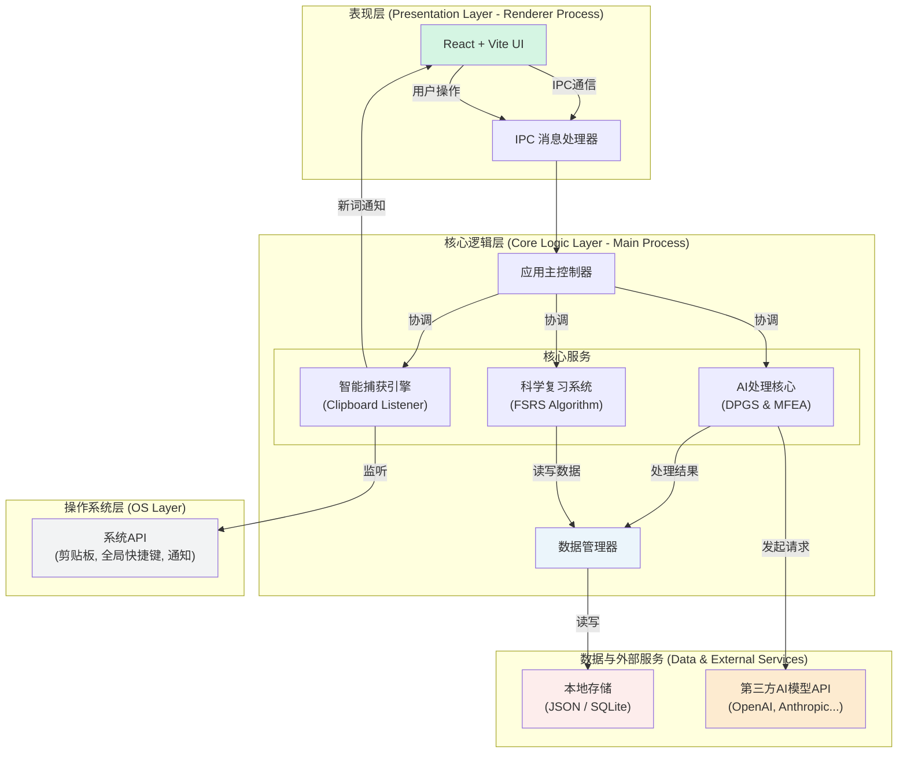
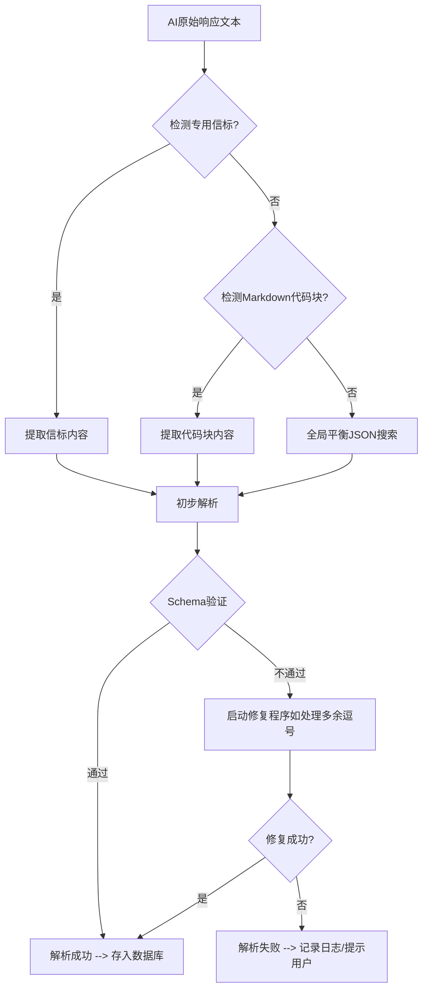

# **FlowLearn: 新一代AI驱动的沉浸式语言学习引擎**

**技术方案书**

> **版本**: 1.0
> **日期**: 2025年8月18日
> **核心理念**: 让技术退居幕后，让学习回归心流。

---

## **执行摘要 (Executive Summary)**

在知识爆炸的时代，高效的跨语言信息获取能力已成为核心竞争力。然而，传统的“阅读-中断-查询-记录”学习范式严重割裂了学习体验，导致认知负荷过高、效率低下。FlowLearn旨在颠覆这一低效模式，通过创新的 **“无感知（Zero-Awareness）”** 理念，打造一个AI驱动的沉浸式语言学习引擎。

FlowLearn通过后台静默监听、智能过滤与批量处理，将生词的收集、查询、解析与复习环节完全自动化，让用户能心无旁骛地沉浸在原文阅读中。其技术核心在于**动态Prompt生成系统（DPGS）** 与**多策略容错解析引擎（MFEA）**，能够与各类大语言模型高效协作，将非结构化的AI回复精准转化为结构化知识。复习系统则引入了经科学验证的**FSRS间隔重复算法**，为每位用户定制个性化的记忆曲线。

我们面向在校学生、科研人员及职场精英等高知群体，切入千亿级的在线语言学习市场。项目初期以跨平台桌面应用为载体，未来将发展为覆盖浏览器插件、移动端的**学习生态系统**，并通过开放API赋能第三方应用。

FlowLearn不仅是一个工具，它代表了一种全新的**人机协作学习范式**，旨在提升学习效率，并致力于通过技术创新，降低高质量学习资源的门槛，最终构建一个数据驱动的、个性化的终身学习智能伴侣。

---

## **1. 市场洞察与项目机遇**

### **1.1 核心痛点：被“中断”的学习流**

对于英文文献、技术文档的深度阅读者而言，学习流程中的“中断”是效率的最大敌人。

*   **认知过载 (Cognitive Overload)**: 每次遇到生词，用户都需进行一系列高成本的操作：切换应用、输入查询、筛选释义、手动记录。这个过程不仅耗时，更严重的是它会**强制中断用户的心流（Flow）状态**，导致思维链条断裂，回归原文后需要重新建立上下文理解。
*   **低效的知识内化 (Inefficient Knowledge Internalization)**: 传统笔记工具解决了“记录”的问题，但“记录”本身并非学习的终点。这些零散的笔记往往成为信息孤岛，缺乏科学的复习机制，导致“收藏即遗忘”，无法有效转化为长期记忆。
*   **AI使用的高门槛 (High Barrier to AI Adoption)**: 尽管大语言模型（LLMs）能力强大，但普通用户难以构建高质量的Prompt，且无法有效处理和利用AI生成的非结构化信息，导致“屠龙之技”无法在日常学习场景中落地。

### **1.2 市场缺口与竞争格局**

目前市场上的解决方案存在明显断层：

| 类别 | 代表产品 | 优势 | 劣势/市场缺口 |
| :--- | :--- | :--- | :--- |
| **传统词典软件** | 欧路词典, Merriam-Webster | 释义精准、离线可用 | **学习流中断**，缺乏AI深度解析与个性化复习 |
| **划词翻译插件** | Google翻译, DeepL | 便捷、即时 | **体验浅层化**，仅限于翻译，缺乏知识管理与复习闭环 |
| **通用笔记应用** | Notion, Evernote | 灵活、功能强大 | **非专业化**，需手动配置复杂流程，无法实现自动化 |
| **AI聊天工具** | ChatGPT, Claude | 解释能力强大、语境化 | **交互成本高**，需要专业Prompt，无法融入现有工作流 |

**FlowLearn的差异化定位**：我们不与任何单一工具直接竞争，而是**定义了一个新的品类**——“无感知学习引擎”。我们整合了上述工具的优点，并通过底层自动化和AI深度集成，彻底解决了它们共同的痛点：**学习流程的中断**。

### **1.3 我们的愿景：构建智能学习伴侣**

我们的愿景是创造一个**真正懂学习的AI伙伴**。它应是无形的、智能的、个性化的，能无缝融入用户的自然学习习惯中，承担所有重复性、机械性的工作，让用户能将宝贵的认知资源完全投入到**理解、思考与创新**中。

---

## **2. 产品方案与核心功能**

### **2.1 产品设计哲学**

*   **无感知原则 (The Principle of Zero-Awareness)**: 产品的核心交互应该是“不可见”的。用户在学习过程中无需感知FlowLearn的存在，所有操作在后台自动完成。
*   **流式体验 (Flow-Oriented Experience)**: 所有设计都服务于保护用户的“心流”状态，将打扰降至最低，实现从输入到知识内化的无缝衔接。
*   **AI赋能而非替代 (AI-Empowered, Not AI-Replaced)**: AI是强大的协作者，而非决策者。用户始终保有对学习内容的最终控制权和对复习节奏的反馈权。

### **2.2 核心功能矩阵**

| 模块 | 功能特性 | 价值主张 |
| :--- | :--- | :--- |
| **智能捕获引擎** | - 后台剪贴板静默监听 - 基于正则、词频、长度的多维智能过滤 - 毫秒级去重与范式化处理 - 可配置的批量处理阈值 | **零打扰收集**：在不中断阅读的前提下，精准捕获有价值的生词。 |
| **AI处理核心** | - 动态Prompt生成系统（DPGS） - 多策略容错解析引擎（MFEA） - 多模型API集成（OpenAI, Anthropic等） - 故障转移与自动重试机制 | **一键深度解析**：将简单的单词查询，升级为包含词源、例句、搭配、同反义词的多维度知识图谱构建。 |
| **科学复习系统** | - 基于FSRS的间隔重复算法 - 四级反馈（忘记/困难/良好/简单） - 记忆曲线可视化 - 每日复习任务智能推送 | **告别遗忘**：将短期记忆科学地转化为长期知识资产，实现高效内化。 |
| **系统级集成** | - 跨平台支持（Windows, macOS, Linux） - 系统托盘常驻与全局快捷键 - 原生系统通知 - 数据本地化存储与隐私保护 | **无缝融入工作流**：让FlowLearn成为操作系统的一部分，随时待命，即用即走。 |

*(图示：展示简洁现代的主界面、卡片式的复习界面和清晰的数据看板)*

---

## **3. 技术架构深度解析**

### **3.1 系统总体架构**

FlowLearn采用基于**Electron**的跨平台桌面应用架构，该架构整合了Node.js的后端能力与Chromium的前端渲染能力，实现了原生体验与Web技术的完美结合。系统整体遵循**分层设计**与**模块化**原则，确保了高内聚、低耦合，为未来的功能扩展与维护奠定了坚实基础。

**架构解析:**

*   **表现层 (Presentation Layer):** 此层是用户直接交互的界面，位于Electron的**渲染进程（Renderer Process）** 中。我们采用`React`和`Vite`构建现代化、响应式的用户界面。所有UI组件，包括单词列表、复习卡片、设置面板等，都在此层实现。它通过Electron的**IPC（Inter-Process Communication）机制**与核心逻辑层进行异步通信，发送用户指令并接收数据更新。

*   **核心逻辑层 (Core Logic Layer):** 运行于Electron的**主进程（Main Process）**，是整个应用的大脑。
    *   **应用主控制器 (App Controller):** 负责应用的生命周期管理、窗口管理，并作为总调度中心，协调各大核心服务模块的工作。
    *   **IPC消息处理器 (IPC Handler):** 作为渲染进程与主进程之间的桥梁，安全地接收和响应来自UI的请求。
    *   **核心服务 (Core Services):**
        *   **智能捕获引擎**: 直接与操作系统层交互，静默监听剪贴板变化，并执行过滤、去重等预处理。
        *   **AI处理核心**: 包含动态Prompt生成（DPGS）和容错解析（MFEA）两大算法，负责与第三方AI模型API进行网络通信，并将返回的非结构化数据转化为结构化知识。
        *   **科学复习系统**: 实现FSRS算法，管理每个词汇的复习状态，并根据用户反馈动态计算下一次复习时间。
    *   **数据管理器 (Data Manager):** 封装了对数据持久层的所有读写操作，为上层服务提供统一的数据访问接口，实现了业务逻辑与数据存储的解耦。

*   **数据与外部服务层 (Data & External Services):**
    *   **本地存储 (Local Storage):** 应用数据完全存储于用户本地，初期使用JSON文件，未来规划迁移至`SQLite`数据库，以保障用户隐私和数据安全，并提升大规模数据处理性能。
    *   **第三方AI模型API (LLM APIs):** 应用通过HTTPS请求与OpenAI、Anthropic等外部大语言模型服务进行交互。

*   **操作系统层 (OS Layer):** FlowLearn深度集成于操作系统，通过调用原生API实现**全局快捷键**注册、**系统托盘**常驻以及发送**原生通知**，确保“无感知”的流畅体验。

这种架构设计将UI渲染与密集型任务（如AI请求、文件IO）彻底分离，确保了即使用户界面在进行复杂操作时，核心的后台监控和处理任务也不会被阻塞，保证了应用的流畅性和响应速度。

### **3.2 核心算法：AI协作双引擎**

#### **3.2.1 动态Prompt生成系统 (Dynamic Prompt Generation System, DPGS)**

这是FlowLearn与AI高效协作的基石。它并非使用静态模板，而是一个能根据上下文动态构建指令的系统。

*   **模式切换**：支持“富文本解析模式”和“纯JSON模式”。前者引导AI进行启发式教学，后者追求极致的解析速度与准确性。
*   **元指令注入**：在Prompt中动态插入元指令，如`{TARGET_LANGUAGE}`、`{USER_CONTEXT}`，并包含明确的结构化输出信标（如`BEGIN_FLOWLEARN_JSON`），引导AI生成更符合预期的内容。
*   **教学策略嵌入**：Prompt内置了教育心理学原则，引导AI不仅提供释义，更能从词源、用法辨析、场景应用等维度进行深度讲解。

#### **3.2.2 多策略容错解析引擎 (Multi-strategy Fault-tolerant Extraction Engine, MFEA)**

这是FlowLearn的技术护城河。鉴于LLM输出的随机性，一个鲁棒的解析引擎至关重要。MFEA采用**分层降级策略**，解析成功率 > 98%。

该引擎结合了**确定性规则**（信标、代码块）和**启发式搜索**（平衡括号算法），并辅以**结构验证与自动修复**，确保了在各种复杂、不规范的AI回复中也能精准提取出结构化数据。

### **3.3 科学记忆算法：FSRS简化模型**

我们采用了广受学术界认可的**自由间隔重复调度器（FSRS）** 的核心思想。其记忆保持率公式为：

$$R(t) = e^{\ln(0.9) \times \frac{t}{S}}$$

*   $R(t)$: 记忆保持率（Retrievability），即在$t$天后仍然记得该词的概率。我们以90%作为目标阈值。
*   $S$: 记忆稳定性（Stability），表示记忆的稳固程度，单位为天。
*   $t$: 距离上次复习的时间。

用户的四级反馈（忘记/困难/良好/简单）将作为输入，通过一组权重参数动态调整每个词汇的**难度（Difficulty）** 和**稳定性（Stability）**，从而为每个用户、每个单词计算出最优的下一次复习间隔。这使得复习计划**高度个性化和动态化**。

---

## **4. 发展路线图 (Roadmap)**

#### **第一阶段：奠定基础 (未来6-12个月)**
*   **目标**: 打造极致的单机体验，验证核心价值。
*   **关键成果**:
    *   **浏览器插件**: 开发Chrome/Edge/Firefox插件，实现网页划词捕获，彻底摆脱剪贴板依赖。
    *   **数据库升级**: 将数据存储从JSON迁移到SQLite，提升性能和可扩展性。
    *   **AI出题官**: AI根据生词自动生成选择题、填空题，丰富复习模式。
    *   **上下文感知**: 捕获生词时自动记录上下文句子，供AI进行更精准的语境化释义。

#### **第二阶段：构建生态 (未来12-24个月)**
*   **目标**: 从工具进化为平台，引入网络效应。
*   **关键成果**:
    *   **云同步与移动端**: 推出移动App（iOS/Android），实现多端词库同步与移动化复习。
    *   **词库市场**: 建立用户生成内容（UGC）平台，允许用户分享、订阅专业领域词库（如“金融术语”、“深度学习论文高频词”）。
    *   **教育者模式**: 提供教师端后台，支持班级管理、词汇任务布置与学情分析。
    *   **专有模型微调**: 基于高质量的（匿名化）用户数据，在开源模型基础上微调一个专注于词汇教学的垂直领域小模型，降低API成本，提升专业性。

#### **第三阶段：引领未来 (未来3-5年)**
*   **目标**: 成为语言学习领域的智能基础设施。
*   **关键成果**:
    *   **开放API平台**: 向第三方阅读、笔记、教育应用开放API，让FlowLearn的捕获与复习能力无处不在。
    *   **智能内容推荐**: 基于用户的词汇能力模型，AI主动推荐难度适中的阅读材料，形成“输入-学习-复习”的完美闭环。
    *   **超越词汇**: 将学习单元从单词扩展到短语、句型，并提供写作辅助功能，根据上下文推荐用户所学词汇，实现“学以致用”。

---

## **5. 结语**

FlowLearn的诞生源于一个简单的信念：**技术应服务于专注，而非分散专注力**。在AI浪潮之下，我们不应止步于将AI包装成另一个需要主动交互的工具，而应思考如何将其能力无缝、无感地注入到现有的工作流中。

我们坚信，FlowLearn所代表的“沉浸式学习”理念，将为数以亿计的语言学习者带来革命性的效率提升。我们不仅在构建一个产品，更是在探索人机协作在教育领域的未来形态。

“科技向善，让每个人都能享受AI时代的红利。” 这不仅是我们的初心，更是我们前行的灯塔。我们期待与抖音AI创变者计划同行，共同将这一愿景变为现实。